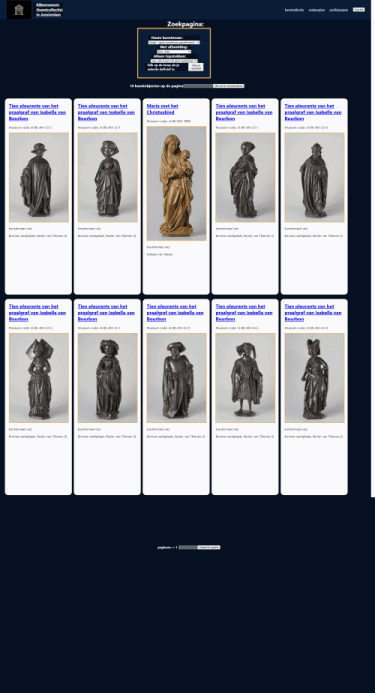

> Dit is een app van het rijksmuseum (te Amsterdam) omdat ik voor school een eindproject moest maken van mijn geleerde kennis.
> Dit is een frontend (web-)applicatie waarin laat zien dat ik stof beheers van school!
>> Dit is gemaakt door: Marcel Brzezinski

# Gebruikers-handleiding van de website van het Rijksmuseum
## Benodigdheden
- Een schone pc;
- Een applicatie (IDE) om deze website te draaien;
- De APIkey die is meegeleverd in de .env;
    + onderstaande handleiding!

## Handleiding

- Stap 1: Kopieer de Github-repository link door naar de code te gaan op GitHub;
- Stap 2: Clone de code in Version Control van je IDE;
- Stap 3: Download de website naar je PC in je IDE;
- Stap 4: Plak de APIkey in de volgende regel: "const apiKey = "
Plak het tussen de aanhalingstekens, bij de volgende bestanden:
  - Home.js
  - ObjectInfo.js
  - Search.js

- Stap 5: in de terminal van je IDE, voor de volgende commando uit
### `npm install`
- Stap 6: in de terminal van je IDE, voor de volgende commando uit
### `npm start`

- Stap 7: Ga naar de register-pagina en geef een gebruikersnaam, email en wachtwoord op!
- Stap 8: Ga nu naar de inlog-pagina en geef je gebruikersnaam en wachtwoord op, om in de website te komen.

Klaar, je kunt nu gebruik maken van de website!

- Stap 9: Om te stoppen doe je: 
### `CTRL + C`

----
## Extra opties

1. NPM build

Creëert met een map met een productie bouw van deze website.

### `npm build`

2. NPM test:

Draait alle unit testen van het project.
### `npm test`

-----------
-----------

# Accounts
Er is geen standaard account waar je gebruik van kan maken, je dient jezelf eerst te registreren en daarna aan te melden voor de website.
Om er gebruik van te maken!
